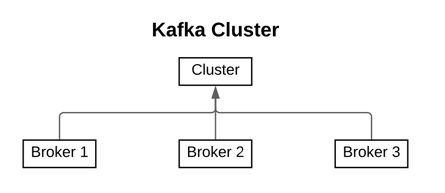
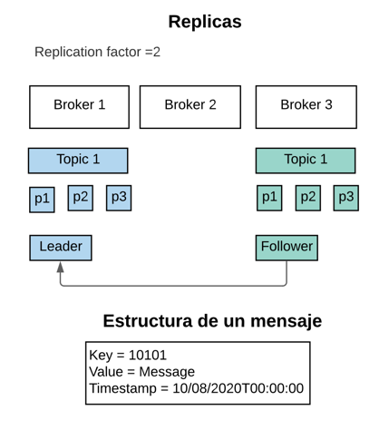
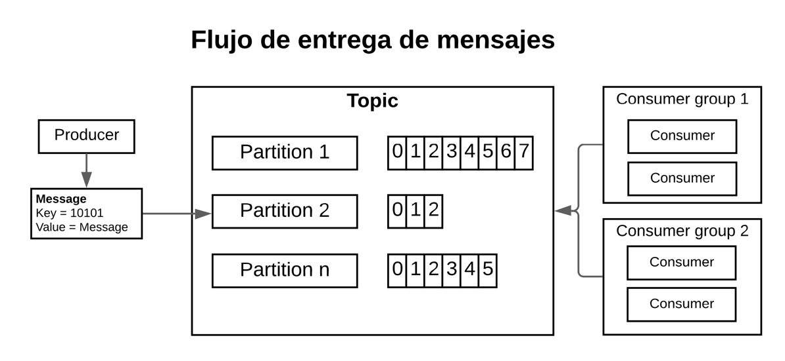

## Definiciones Basicas

### Broker
Un servidor de kafka es conocido como un Broker, un cluster de kafka consiste en múltiples brokers

### Mensaje
Un mensaje es una unidad de datos en Kafka, está compuesto por una llave y un valor.

### Topics / Partitions / Offsets
Un **topic** es un stream (flujo) de mensajes, cada topic se compone de una o más **particiones**. Los mensajes son colocados en las particiones y son ordenados de acuerdo
a un número llamado **offset**.

Tener múltiples particiones permite tener más consumidores de mensajes funcionando de forma concurrente, esto se ve reflejado en el incremento del
throughput(tasa de transferencia).

### Replicas
Para incrementar la disponibilidad de la información, los topics se deben replicar en múltiples brokers, esto se define en el atributo **replication-factor**, el cual define el número de copias de la información. Cada topic tendrá asignado un líder y seguidores.

Una replica actualizada se conocerá como (**In-sync**) y se mantiene actualizada con los cambios del líder. Si el líder falla una In-sync se puede convertir en lider.

En un ambiente saludable todas las replicas deben encontrarse In-sync, es aceptable que no se encuentren de ese modo después de un fallo.

### Producer
Un producer es un componente que publica mensajes en uno o más topics. Puede seleccionar en que partición desea colocar los mensajes

### Consumer
Un consumer lee mensajes de uno o más topics y los procesa. La diferencia entre el la posición actual del consumer y el mensaje más nuevo de la partición se conoce como (**offset lag**).

Si el offset lag no es muy largo eso no es un problema, se puede convertir en uno si se acerca al _**rentention period**_ (Periodo de tiempo que se mantienen los mensajes en kafka).

### Consumer groups
Un consumer group contiene uno o más consumidores de mensajes, Los mensajes de una partición son procesados por un consumidor del grupo ( Esto asegura que los mensajes se procesen en orden).

Si hay más particiones que consumers, un consumer puede leer más de una partición. Si Hay más consumers que particiones algunos se quedarán sin partición a consumir.

---

---
